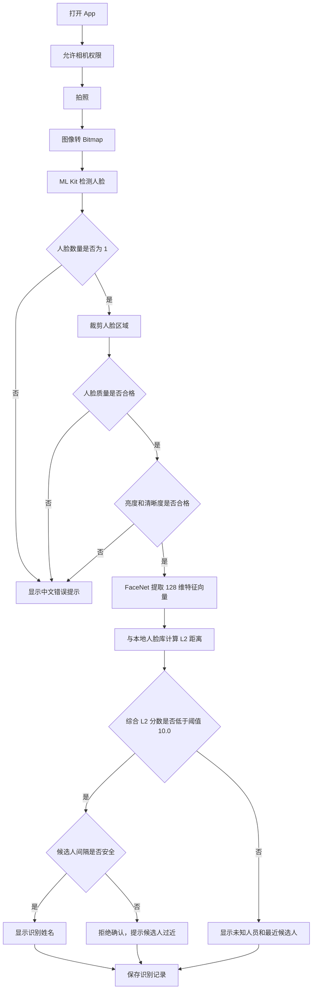

# 安卓人脸识别期末作业报告框架

## 1. 项目背景

本项目实现一个以本地离线识别为主线的人脸识别 App。用户可以先录入人员姓名和人脸，之后通过手机摄像头识别当前人员身份。本地模式不依赖云端接口，避免网络、账号权限和 API 费用问题，更适合期末演示。

在本地识别主线之外，系统新增云端 API 模式，可选择 Face++ 托管云端 API 或开源 CompreFace 自部署服务，形成“本地离线识别 + 线上服务识别”的双模式架构。这样既能保证断网演示稳定，也能展示线上人脸库和 REST API 集成能力。

## 2. 需求分析

系统需要完成五类核心需求：

- 人脸录入：输入姓名并拍照，保存对应人脸特征。
- 录入建议：提示每个人建议录入 2-3 次，以提高识别稳定性。
- 人脸识别：拍照后判断当前人脸是否属于已录入人员。
- 视频多人识别：持续分析相机预览帧，在同一画面中逐张识别多个人脸。
- 结果展示：显示姓名、相似度、L2 距离、判定说明和识别记录。
- 演示引导：首页根据当前人脸库和识别记录提示下一步操作，降低现场演示时漏步骤的风险。
- 云端识别：选择 Face++ 或 CompreFace 并填写对应 API 配置后，可使用云端人脸库完成录入与识别。

异常场景包括：未授权相机、未检测到人脸、检测到多张人脸、模型加载失败、本地数据损坏。

## 3. 系统架构

系统采用单 Activity 结构，降低课程项目复杂度。主要模块如下：

- UI 层：负责相机预览、录入操作、识别操作、结果展示和记录展示。
- UI/动效层：负责首页入场、结果状态切换、全屏多人识别扫描反馈和小屏不重叠验收，确保演示时观众能看清当前状态。
- 相机模块：CameraX 负责预览和拍照。
- 视频分析模块：CameraX ImageAnalysis 按固定间隔抽取预览帧，用于多人脸识别。
- 图像处理模块：将拍照结果转换为 Bitmap，并根据人脸框裁剪人脸区域。
- 人脸检测模块：ML Kit Face Detection 检测画面中的人脸数量和人脸框。
- 特征提取模块：TensorFlow Lite 运行 FaceNet 模型，输出 128 维特征向量。
- 质量控制模块：检查人脸大小、角度、贴边、亮度和清晰度，避免低质量人脸进入识别流程。
- 识别模块：使用 L2 距离比较当前人脸和本地人脸库。
- 人脸库健康模块：检查人员数量、每人样本数量、特征向量维度、同人样本一致性、跨人员区分度和阈值校准建议。
- 本地存储模块：应用私有目录 JSON 文件保存人脸特征和识别记录，并兼容旧版 SharedPreferences 数据迁移。
- 演示引导模块：根据人脸库人数、每人样本数量和识别记录覆盖情况，生成首页“下一步”提示。
- 云端状态模块：保存并展示最近一次云端连接测试时间、提供商和成功/失败原因，方便确认云端第二模式是否可用。

## 4. 识别流程



## 5. 核心原理

FaceNet 的作用是把一张人脸图像转换成固定长度的特征向量。相同人员的人脸向量距离通常更近，不同人员的人脸向量距离通常更远。因此，本项目通过计算 L2 距离完成身份匹配。

本项目默认阈值为 `10.0`。当当前人脸向量与某个已录入人员的综合 L2 距离低于阈值时，系统判定为该人员；否则判定为未知人员，并显示“最接近的已录入人员”和距离原因。综合距离会参考最近样本距离、平均距离和样本稳定性。如果第一候选人和第二候选人距离过近，系统会拒绝确认，降低误识别风险。每个人最多保存 5 组特征向量，超过后移除最旧数据，避免本地数据无限增长。

综合 L2 分数公式为：

```text
score = minDistance + (averageDistance - minDistance) * 0.35
```

其中 `minDistance` 表示当前人脸与某个人最近一组样本的距离，`averageDistance` 表示与该人员所有样本的平均距离，`0.35` 是稳定性惩罚权重。系统同时使用候选人安全间隔 `0.75` 和 Top1/Top2 比值判断相似候选是否过近；若过近则拒绝确认。

视频多人识别使用 CameraX `ImageAnalysis` 每隔约 1.5 秒抽取一帧，ML Kit 检测该帧中的多张人脸，再逐张裁剪、提取特征并调用同一个识别引擎。当前版本会在相机预览上叠加人脸框和姓名/未知标签，同时在结果区以文字列表展示“第 1 张、第 2 张……”的识别结果。视频模式只有在至少两张人脸同时入镜、且出现有效稳定身份标签后，才写入一条“视频演示”记录，用于测试摘要验收覆盖；该记录只写一次，避免连续画面把记录刷满。

为了提高演示稳定性，视频多人识别加入了轻量跨帧稳定机制：系统使用人脸框位置匹配前后帧轨迹，用姓名、未知人员或质量不足作为稳定判断标签，并在同一轨迹的最近几帧中做短窗口投票。短暂单帧误判不会立刻替换稳定姓名，只有新身份获得足够票数后才切换显示，从而降低误识别和标签闪烁。

### 云端 API 模式

云端模式支持 Face++ 托管云端 API 和 CompreFace 自部署服务。Android 端仍然负责拍照、单脸检测和质量过滤，然后将裁剪后的人脸图片通过 REST API 上传到云端服务。Face++ 方案适合“不想本地部署、尽量少花钱”的课程演示；CompreFace 方案适合说明开源自部署架构。系统根据返回的相似度/置信度和阈值 `0.75` 判断云端识别成功或未知人员。连接测试后，界面会保存最近测试时间、提供商和成功/失败原因；如果切换到另一个提供商，会提示重新测试，避免误用旧状态。

该模式体现了线上服务化能力，但不作为最低交付依赖。若现场网络或服务不可用，可以切回本地离线模式完成演示。

录入和识别前还会检查裁剪后人脸图像的平均亮度和基础清晰度。过暗、过曝或明显模糊的图像会被拒绝，避免低质量样本进入本地人脸库，也能让识别失败时给出更具体的调整建议。

人脸库健康分析会进一步检查同一人员多组样本之间的最大 L2 距离。如果同一个人的样本差异过大，说明录入时可能混入错误人员、光线过差或姿态变化过大，系统会在首页和测试摘要中提示重新补录。

当本地人脸库中有多个人员时，系统还会计算不同人员之间最近的跨人 L2 距离。如果两个人距离过近，说明模型特征上容易混淆，系统会在测试摘要中列出这对人员并提示补录更清晰、角度更稳定的样本。

阈值校准建议根据“同人最大 L2”和“跨人最近 L2”推导。如果二者之间有明显间隔，系统会给出一个建议阈值；如果二者重叠，说明当前人脸库质量不足，系统会建议先补录而不是调高阈值。

## 6. 核心代码说明

- `MainActivity.kt`：负责页面交互、相机拍照、录入和识别流程编排。
- `CloudRecognitionRouter.kt`：根据当前云端提供商把连接测试、录入和识别分发给 Face++ 或 CompreFace 网关。
- `CloudFaceGateway.kt`：定义云端识别网关统一接口。
- `FaceNetModel.kt`：加载 `facenet.tflite` 并输出 128 维人脸特征向量。
- `RecognitionEngine.kt`：计算 L2 距离、相似度和识别解释，并过滤非 128 维或包含异常值的特征向量；若跳过异常样本，会在解释中显示数量。
- `FaceEmbeddingGuard.kt`：检查模型输出特征是否为 128 维有限向量，并在同名补录时拒绝离群样本，避免污染人脸库。
- `LiveRecognitionStabilizer.kt`：对视频多人识别结果做跨帧跟踪、短窗口投票和平滑显示，减少标签跳动和多人串标。
- `FaceImageQualityAnalyzer.kt`：检查裁剪后人脸图像的亮度和清晰度。
- `FaceLibraryHealthAnalyzer.kt`：检查人脸库健康状态、同人样本一致性、跨人员区分度和阈值校准建议，清理异常向量，并输出演示准备度。
- `RecognitionRecordManager.kt`：负责新增识别记录、保持最新记录在顶部，并限制最多保存 30 条。
- `DemoCoverageAnalyzer.kt`：根据识别记录分析答辩验收覆盖情况。
- `DemoGuideBuilder.kt`：根据当前人脸库和识别记录生成首页下一步提示，引导演示者依次完成录入、成功识别、未知人员、多人视频和摘要生成。
- `CloudDemoMaterialBuilder.kt`：生成云端 API 演示材料，用于说明 Face++、CompreFace、本地离线和 GPT 多模态模型的取舍。
- `FullReportBuilder.kt`：将截图摘要、技术详情、人脸库明细、完整识别记录、云端 API 演示材料、隐私与风险说明和报告使用建议组合成可复制的完整报告素材。
- `FaceStore.kt`：保存和读取本地人脸库、识别记录，并处理数据损坏兜底。
- `BitmapUtils.kt`：负责拍照图像解码、旋转和人脸裁剪。

## 7. 测试用例

| 编号 | 场景 | 预期结果 |
| --- | --- | --- |
| 1 | 录入 A 后识别 A | 显示 A、相似度、L2 距离 |
| 2 | 录入 A、B 后识别 B | 显示 B |
| 3 | 未录入人员识别 | 显示未知人员 |
| 4 | 开启视频多人识别 | 同一画面显示人脸框、姓名/未知标签和逐张识别结果 |
| 5 | 候选人距离过近 | 拒绝确认，提示降低误识别风险 |
| 6 | 画面中没有人脸 | 提示未检测到人脸 |
| 7 | 拍照识别画面中有多张人脸 | 提示只保留一张人脸 |
| 8 | 拒绝相机权限 | 提示开启相机权限 |
| 9 | 清空识别记录 | 记录清空，人脸库保留 |
| 10 | 清空人脸库 | 再次识别提示先录入人员 |
| 11 | 关闭网络后识别 | 仍能正常识别 |
| 12 | 人脸库样本不足 | 首页和测试摘要提示需补强 |
| 13 | 同人样本差异过大 | 首页和测试摘要提示重新补录 |
| 14 | 不同人员特征过近 | 测试摘要提示存在混淆风险 |
| 15 | 阈值校准建议 | 测试摘要输出同人最大 L2、跨人最近 L2 和建议阈值 |
| 16 | 云端连接状态 | 测试 Face++ 或 CompreFace 后显示最近测试时间、提供商和结果说明 |
| 17 | 首页下一步提示 | 根据当前演示进度提示录入、补录、识别、未知人员、多人视频或生成摘要 |
| 18 | 复制完整报告 | 剪贴板内容包含截图摘要、技术详情、人脸库明细、完整识别记录、云端 API 演示材料、隐私与风险说明和报告使用建议 |

## 8. 单元测试

项目为核心识别模块 `RecognitionEngine` 增加了本地单元测试，重点验证不依赖摄像头和模型的算法规则：

- 空人脸库时返回未知人员。
- 人脸向量完全一致时识别成功。
- 多个人员同时存在时，选择平均 L2 距离最近的人员。
- 最小距离超过阈值 `10.0` 时返回未知人员，并记录最接近候选人。
- 第一候选和第二候选距离过近时拒绝确认，减少误识别。
- 匹配结果说明安全区、稳定区、边界区和拒识区。
- 人员存在但没有可用特征时返回未知人员。
- 当前向量不是 128 维、库中向量维度错误或包含 NaN/Infinity 时不会崩溃，会返回未知人员或跳过异常样本，并解释跳过数量。
- 人脸质量测试覆盖脸太小、贴边、侧脸角度过大、头部倾斜过大、画面偏暗、过曝和模糊等情况。
- 人脸特征守卫测试覆盖异常向量、L2 距离、离群样本拒绝和异常历史样本忽略。
- 识别记录管理测试覆盖新增记录置顶、超出数量限制后裁剪旧记录。
- 视频稳定器测试覆盖连续帧确认、单帧噪声保持稳定结果、新身份赢得投票后切换、轨迹过期和同帧轨迹不复用。
- 人脸库健康测试覆盖空库、样本不足、已可演示、异常特征清理、NaN/Infinity 清理、样本一致性风险、跨人员混淆风险和阈值建议。
- 验收覆盖分析测试覆盖识别成功、未知人员、边界/拒识、候选人过近和视频多人识别等场景。
- 测试摘要模块统计录入人数、特征组数、识别成功次数、未知人员次数和平均相似度。
- 演示引导测试覆盖空人脸库、只录入 1 人、样本不足、成功识别后提示未知人员、未知人员后提示多人视频，以及云端模式先测试连接。
- 云端路由测试覆盖 Face++ 与 CompreFace 提供商选择，避免云端分发逻辑和页面代码耦合。
- 云端演示材料测试覆盖 Face++、CompreFace、GPT 多模态模型取舍、云端记录统计和连接测试步骤。
- 完整报告模块测试覆盖摘要、人脸库明细、完整识别记录、云端 API 演示材料、隐私与风险说明和报告使用建议。

## 9. 演示结果

报告中建议放入以下截图：

- App 首页和相机权限授权。
- 首页入场后的首屏状态，证明相机预览、演示准备度、下一步提示和核心按钮清晰可见。
- 首页“下一步”提示。
- 人脸录入成功。
- 已录入人数和每人录入次数。
- 识别成功。
- 录入成功、识别成功、未知人员或拒识之间的状态切换截图或录屏帧。
- 未知人员识别。
- 视频多人识别，重点保留全屏预览、人脸框、扫描反馈、姓名/未知标签和逐张结果。
- 小屏或窄屏设备截图，证明首页、设置页和全屏多人识别不发生按钮、长文案、标签或结果区重叠。
- 候选人过近拒绝确认或边界区说明。
- 无人脸或多人脸错误提示。
- 识别记录列表。
- 测试摘要。
- 复制后的测试摘要文字，可直接放入测试结果小节。
- 复制后的完整报告素材，可作为报告附录或答辩备用材料。
- 云端 API 演示材料，说明为什么 Face++ 优先、CompreFace 作为自部署备选、GPT 多模态模型不适合作为人脸库身份比对。
- 隐私与风险说明，解释本地存储、云端上传边界、测试人员同意和未实现活体检测的限制。
- 关闭网络后仍可识别。

## 9.1 真实测试结果

| 项目 | 结果 |
| --- | --- |
| 测试日期 | 2026-06-02，本表记录当前构建状态；历史模拟器截图只能作为历史参考，最终报告需补充真机型号 |
| 测试设备 | 当前命令行 `adb devices` 为空，尚未完成本轮真机或模拟器复验 |
| 单元测试命令 | `./gradlew testDebugUnitTest --no-daemon` |
| 单元测试结果 | 通过 |
| APK 构建命令 | `./gradlew assembleDebug --no-daemon` |
| APK 构建结果 | 通过，输出 `app/build/outputs/apk/debug/app-debug.apk`，根目录副本为 `人脸识别演示台-debug.apk` |
| 模拟器启动验证 | 本轮待复验；当前应检查首页、2x2 演示流程卡、“录入样本”、“拍照识别”、“多人视频”和“材料”入口均可见 |
| UI/动效真机验收 | 待补充，需记录首页入场、状态切换、全屏多人识别扫描效果和小屏不重叠截图或录屏 |
| 待补充真机材料 | S2-S8 真实人脸录入、识别、未知人员、视频多人识别、断网识别截图；S16-S19 高端动效验收截图 |

## 10. 项目不足与改进

当前项目没有实现活体检测，因此无法完全防止照片翻拍攻击。第四阶段已把活体检测、模型升级、性能 delegate 和正式发布边界写入测试摘要与完整报告：系统会说明这些属于后续增强项，启用前必须补齐真机 A/B 样本、阈值重标定、误识/拒识统计和性能记录，不能在没有数据时直接替换当前稳定主流程。后续可以接入静态活体检测模型，或增加眨眼、摇头等动作活体检测。同时可以继续优化视频多人识别的跨帧跟踪、投票稳定、阈值可视化、Room 数据库存储和更完整的多页面 UI。首页入场、状态切换、全屏多人识别扫描效果和小屏不重叠目前应作为真机验收项记录，不能在没有设备截图或录屏时写成已通过。

## 11. 开源引用

本项目参考了 `FaceRecognition_With_FaceNet_Android` 的 FaceNet TFLite 模型使用方式，并在此基础上改造为课程作业版 App。引用地址：https://github.com/shubham0204/FaceRecognition_With_FaceNet_Android

第三方依赖说明：

| 名称 | 用途 | 许可证/来源 |
| --- | --- | --- |
| CameraX / AndroidX | 相机预览、拍照、视频帧分析和 Android 基础库 | AndroidX / Apache-2.0 |
| ML Kit Face Detection | 本地人脸检测、人脸框和角度信息 | Google ML Kit |
| TensorFlow Lite | 本地运行 FaceNet 模型 | TensorFlow / Apache-2.0 |
| Material Components | 界面组件 | Apache-2.0 |
| FaceRecognition_With_FaceNet_Android | FaceNet 模型集成思路和模型文件来源 | Apache-2.0 |
